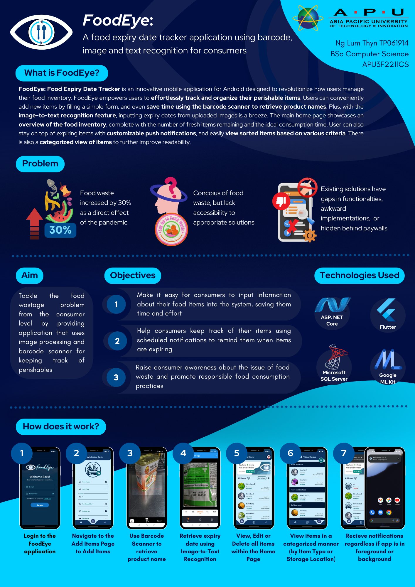

# Final Year Project

# Features
- User Login/Logout and Register
- Home Page/Item Listings
- Pages for CRUD Functionalities
- Sorting Functionality
- Barcode Scanner
- Image-to-Text Recognition
- Categorized Item Viewing
- Push Notification

# Getting Started
### Flutter SDK
- Installation guides [from the official website](https://docs.flutter.dev/get-started/install)
### Android Emulator
- Install Android Virtual Device Manager and create a emulated mobile device (API 33) ([full guide here](https://developer.android.com/studio/run/managing-avds))

# Technologies Used
- Flutter framework with Dart on VS Code
- AVD Manager for mobile device emulation
- Google ML Kit for text recognition
- pub.dev for all libraries/dependencies

# Check Out The Project
